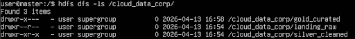

# Bitácora SBD-18 · Operación "Estructura del Pantano"
**Módulo:** Sistemas de Big Data · **Unidad:** UD3 · **Sesión:** 18

---

## Reto 1 · Arquitectura de Capas

Se crea la raíz del proyecto y las tres capas del Data Lake:

```bash
hdfs dfs -mkdir -p /cloud_data_corp/landing_raw
hdfs dfs -mkdir -p /cloud_data_corp/silver_cleaned
hdfs dfs -mkdir -p /cloud_data_corp/gold_curated
```

Cada capa tiene un propósito diferenciado: `landing_raw` recibe los datos en bruto tal como llegan y no se modifica nunca (fuente de verdad inmutable). `silver_cleaned` almacena datos que ya han pasado una validación de formato. `gold_curated` contiene datos curados listos para que los analistas los consuman.

Los analistas **no pueden escribir en `landing_raw`** porque cualquier modificación rompería la trazabilidad del dato original e impediría reproducir los pipelines de procesamiento desde el inicio.

---

## Reto 2 · Permisos y Seguridad

Se configuran los permisos simulando dos roles: **Data Engineer** (propietario `hdfs`) y **Data Analyst** (grupo `analistas`).

```bash
# landing_raw: solo el propietario escribe, el resto solo lee (740)
hdfs dfs -chmod 740 /cloud_data_corp/landing_raw

# gold_curated: analistas pueden leer y navegar, pero no escribir ni borrar (750)
hdfs dfs -chmod 750 /cloud_data_corp/gold_curated
hdfs dfs -chown hdfs:analistas /cloud_data_corp/gold_curated

# Verificación
hdfs dfs -ls -d /cloud_data_corp/landing_raw
hdfs dfs -ls -d /cloud_data_corp/gold_curated
```

Con `750`, el grupo `analistas` tiene `r-x` (leer y entrar al directorio) pero no `w`, por lo que cualquier intento de borrado es denegado:

```bash
hdfs dfs -rm /cloud_data_corp/gold_curated/ventas_ok.csv
# rm: Permission denied: user=analyst, access=WRITE
```



---

## Reto 3 · Ingesta y Cuarentena

Se reciben tres ficheros. Los dos con formato conocido van a `landing_raw`; el binario se aísla en cuarentena:

```bash
# Ficheros válidos → landing_raw
hdfs dfs -put ventas_ok.csv /cloud_data_corp/landing_raw/
hdfs dfs -put logs_server.json /cloud_data_corp/landing_raw/

# Crear zona de cuarentena y aislar el fichero corrupto
hdfs dfs -mkdir -p /quarantine/
hdfs dfs -put datos_corruptos.bin /quarantine/

# Etiqueta de metadatos explicando el motivo
echo "Fichero: datos_corruptos.bin" > label.txt
echo "Motivo: extensión .bin sin esquema identificable, no procesable por los pipelines actuales." >> label.txt
echo "Acción: aislado en /quarantine/, pendiente de revisión." >> label.txt
hdfs dfs -put label.txt /quarantine/
```

`datos_corruptos.bin` se descarta del flujo principal porque su formato binario no tiene esquema definido ni puede ser procesado por las herramientas del Data Lake. Mezclarlo con datos válidos en `landing_raw` comprometería la integridad de la capa de ingesta.

---

## Árbol Final

```bash
hdfs dfs -ls -R /cloud_data_corp
```


